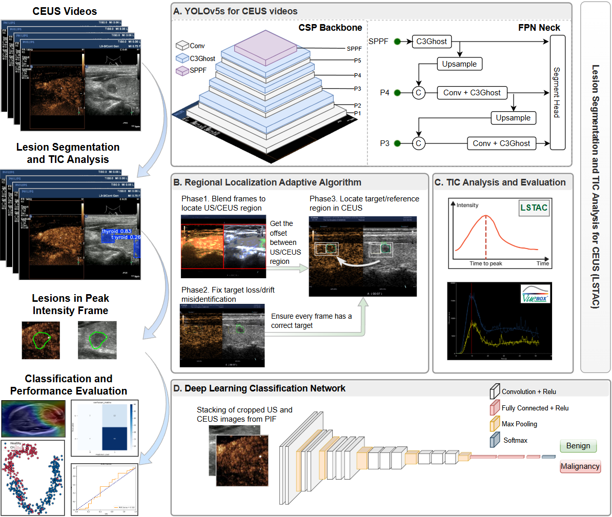
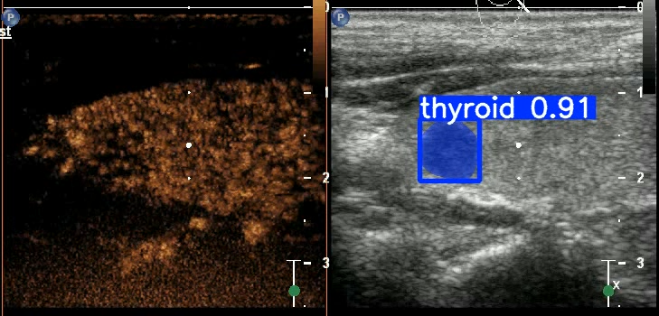
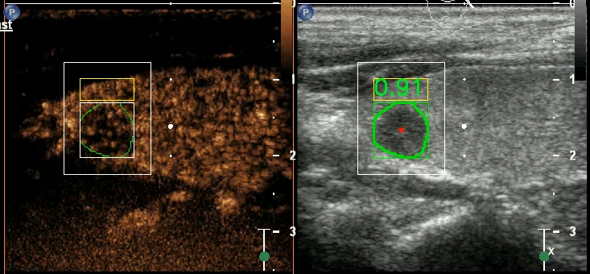
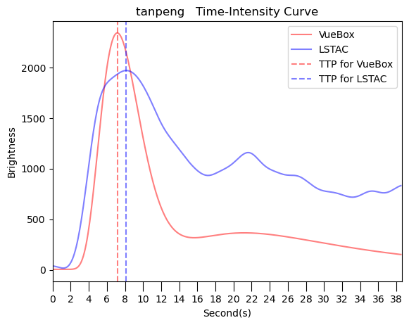

# LSTAC -- Lesion Segmentation and TIC Analysis for CEUS
----

Implementation of *A Deep Learning-based Framework for the Malignancy Analysis of Thyroid Lesions in Contrast-Enhanced Ultrasound Videos*
<p align="center">
  
</p>

## Pre-requisites
----
- python >= 3.8
- torch >= 1.10
  
```bash
pip install -r requirements.txt
```


## Usage
----

#### Segmentation
Download the yolov5-seg checkpoints from [GitHub](https://github.com/ultralytics/yolov5/?tab=readme-ov-file#pretrained-checkpoints) and put them in the `segment` folder.
Datasets structure should be same as `segmentation\datasets\thyroid-example`.
```bash
cd segmentation
python segment/train.py --img 960 --batch 16 --device 0 --epochs 500 --cfg models/hub/yolov5s_modified.yaml --weights segment/yolov5s-seg.pt --data datasets/thyroid.yaml
```
Segment result:
<p align="center">
  
</p>

### Frame Extraction
Run `frame_extact_all.ipynb` to analysis all CEUS videos.
Run `merge_extracted_frames.ipynb` to merge all extracted frames into the `extract-key-frame` folder.

Analysis result:
<p align="center">
  
</p>
<p align="center">
  
</p>


### Classification
Make sure you have the extracted key frames in the `extract-key-frame` folder.
`extract-key-frame` dataset folder structure should be like this:
```
extract-key-frame
├── cohort1
│   ├── all
│   │   ├── roi1
│   │   │   ├── 0
│   │   │   │   ├── imgs
│   │   │   ├── 1
│   │   │   │   ├── imgs
│   │   ├── target
│   │   │   ├── 0
│   │   │   │   ├── imgs
│   │   │   ├── 1
│   │   │   │   ├── imgs
│   ├── ultrasound
│   │   ├── same as 'all' folder
│   ├── contrast
│   │   ├── same as 'all' folder
├── cohort2
│   ├── ........
```

Classification training:
```bash
cd classification
# Argument details can be found in the `run.py` file.
python run.py --data ../extract-key-frame/ultrasound/ --save ./result/exp1 --model InceptionV3  --area roi1 --epoch 300 --lr 0.00001 --batch_size 32
```
Classification testing:

```bash
# Argument details can be found in the `test.py` file.
python test.py --data ../extract-key-frame  --path ./result
```


